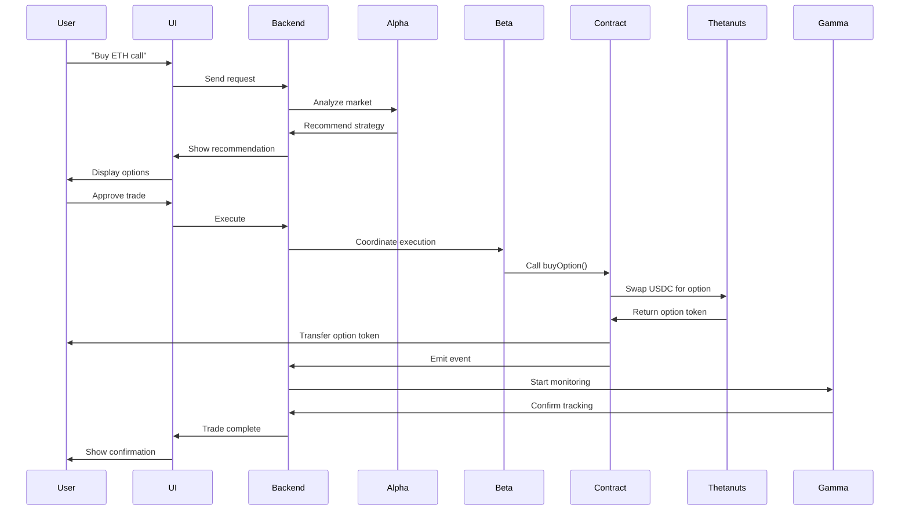

# System Overview

## Technical Architecture

BethNa's architecture is designed for **scalability**, **security**, and **user experience**. It separates concerns into distinct layers, each optimized for its specific role.

## Architecture Layers

```
┌─────────────────────────────────────────────┐
│         User Interface Layer                │
│  (Next.js 15, React, Wallet Connectors)    │
└─────────────────────────────────────────────┘
                    ↓
┌─────────────────────────────────────────────┐
│         AI Intelligence Layer               │
│  (Python FastAPI, Agent Swarm, ML Models)  │
└─────────────────────────────────────────────┘
                    ↓
┌─────────────────────────────────────────────┐
│         Smart Contract Layer                │
│  (SentientTrader.sol, Base Network)        │
└─────────────────────────────────────────────┘
                    ↓
┌─────────────────────────────────────────────┐
│         DeFi Infrastructure Layer           │
│  (Thetanuts, Pyth, dYdX)                   │
└─────────────────────────────────────────────┘
```

## Layer Details

### 1. User Interface Layer

**Technology**: Next.js 15 (Turbo), React 18, TypeScript

**Components**:
- **Dashboard**: Portfolio overview, P&L tracking
- **Trading Interface**: AI chat, strategy selector
- **Position Manager**: Active positions, risk metrics
- **Analytics**: Historical performance, backtesting

**Key Features**:
- **Server-Side Rendering (SSR)**: Fast initial page loads
- **Progressive Web App (PWA)**: Installable, works offline
- **Responsive Design**: Desktop, tablet, mobile optimized
- **Dark Mode**: "Bespoke Radiant" design system

### 2. AI Intelligence Layer

**Technology**: Python 3.11, FastAPI, LangChain, scikit-learn

**Components**:
- **Agent Alpha**: Market analysis engine
- **Agent Beta**: Execution coordinator
- **Agent Gamma**: Risk monitoring service
- **Agent Delta**: Hedging optimizer (Phase 2)

**Data Sources**:
- Pyth Network (price feeds)
- Thetanuts API (options data)
- dYdX API (perp markets)
- Twitter API (sentiment)

**Machine Learning**:
- Random Forest (signal generation)
- LSTM (time series prediction)
- Sentiment Analysis (NLP)

### 3. Smart Contract Layer

**Technology**: Solidity 0.8.20, Foundry, OpenZeppelin

**Components**:
- **SentientTrader.sol**: Main trading contract
- **Access Control**: Authorization system
- **Event Emitters**: Audit trail

**Security**:
- OpenZeppelin contracts (audited)
- Slippage protection (hard-coded)
- Emergency pause mechanism

### 4. DeFi Infrastructure Layer

**Protocols**:
- **Thetanuts Finance**: Options liquidity
- **Pyth Network**: Price oracles
- **dYdX** *(Phase 2)*: Perp hedging
- **Base Network**: L2 settlement

## Component Interactions

### Trade Execution Flow



## Infrastructure

### Hosting

| Component | Provider | Reason |
|-----------|----------|--------|
| **Frontend** | Vercel | Edge network, auto-scaling |
| **Backend API** | Railway | Docker support, easy deploys |
| **Database** | Supabase | Postgres, real-time subscriptions |
| **AI Models** | Modal | GPU acceleration for ML |

### Monitoring

| Tool | Purpose |
|------|---------|
| **Sentry** | Error tracking |
| **PostHog** | Analytics, feature flags |
| **Grafana** | System metrics |
| **Dune Analytics** | On-chain analytics |

### Data Storage

| Data Type | Storage | Backup |
|-----------|---------|--------|
| **User Profiles** | Supabase Postgres | Daily snapshots |
| **Trade History** | On-chain (events) | IPFS archive |
| **ML Models** | S3-compatible | Version control |
| **Analytics** | BigQuery | 90-day retention |

## Scalability Considerations

### Current Capacity

- **Users**: 10,000 concurrent
- **Trades/Second**: 50
- **API Requests/Second**: 500

### Phase 2 Targets

- **Users**: 100,000 concurrent
- **Trades/Second**: 500
- **API Requests/Second**: 5,000

### Scaling Strategy

1. **Horizontal Scaling**: Add more backend instances
2. **Database Sharding**: Partition by user ID
3. **Caching**: Redis for hot data
4. **CDN**: Static assets on edge network

---


**Dive deeper**: [Data Flow](data-flow.md) | [Application Layer](application-layer.md)

