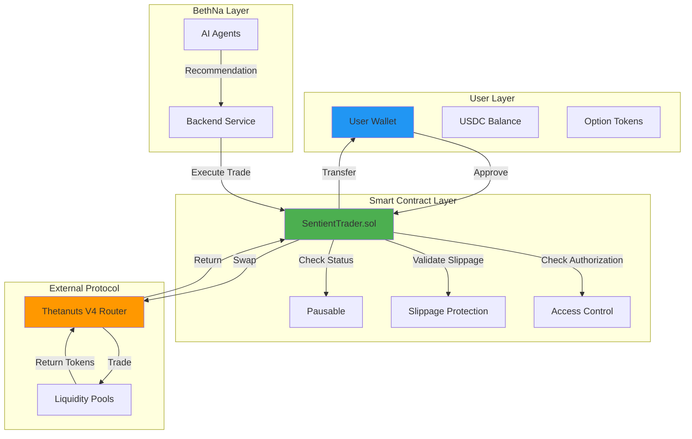
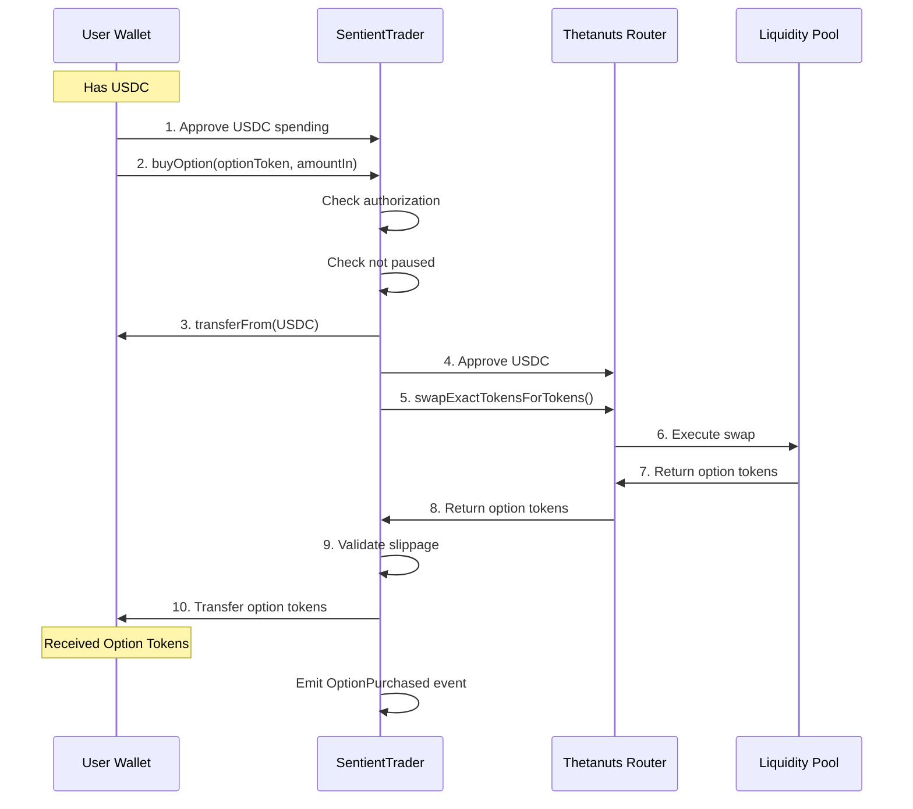
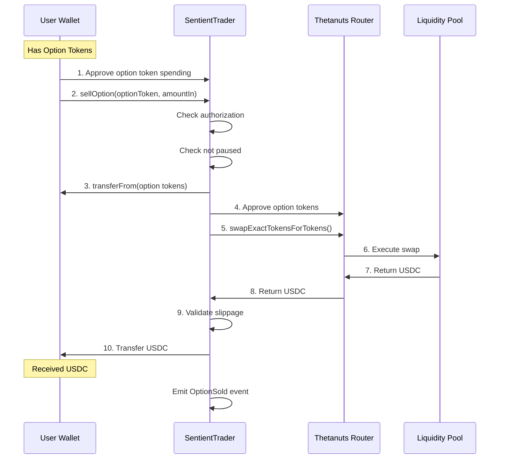
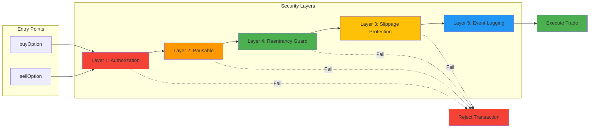
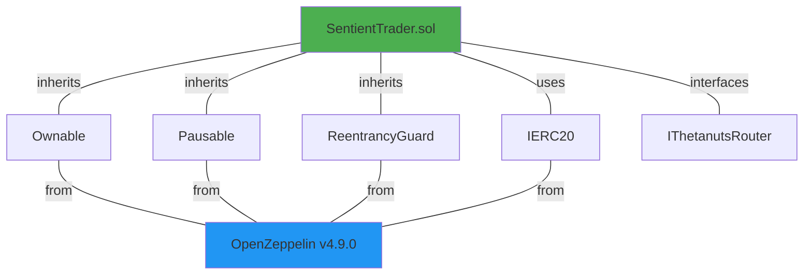

# Contract Infrastructure

## The SentientTrader Protocol

The on-chain backbone of BethNa is the `SentientTrader.sol` smart contract. It acts as a secure, non-custodial proxy between users and the Thetanuts V4 Router.

## Core Design Principles

### 1. Non-Custodial Architecture
- Uses standard ERC-20 allowances
- Never holds user funds beyond atomic transaction
- All option tokens returned immediately to user wallet

### 2. Security-First Approach
- Strict access control (`onlyAuthorized` modifier)
- Emergency pause functionality
- Hard-coded slippage protection
- Comprehensive event logging

### 3. Gas Optimization
- Minimal storage operations
- Efficient approval patterns
- Optimized call paths

## Contract Overview

### Architecture Diagram



### Key Components

| Component | Purpose |
|-----------|---------|
| **Access Control** | Whitelist of authorized agent addresses |
| **Pausable** | Emergency circuit breaker |
| **Slippage Protection** | Maximum 10% slippage enforcement |
| **Event Emission** | Complete audit trail |
| **Router Integration** | Direct interface to Thetanuts V4 |

### State Variables

```solidity
// Access control
mapping(address => bool) public authorizedTraders;

// Protocol addresses
address public thetanutsRouter;
address public immutable USDC;

// Safety parameters
uint256 public constant MAX_SLIPPAGE_BPS = 1000; // 10%

// Admin
address public owner;
bool public isPaused;
```

## Interaction Flow

### Buy Option Flow



### Sell Option Flow



## Smart Contract Functions

### Core Trading Functions

#### `buyOption()`
```solidity
function buyOption(
    address optionToken,
    uint256 amountIn,
    uint256 minAmountOut
) external onlyAuthorized whenNotPaused returns (uint256)
```
Purchases options from Thetanuts using USDC.

#### `sellOption()`
```solidity
function sellOption(
    address optionToken,
    uint256 amountIn,
    uint256 minAmountOut
) external onlyAuthorized whenNotPaused returns (uint256)
```
Sells options back to Thetanuts for USDC.

### Administrative Functions

#### `setAuthorizedTrader()`
```solidity
function setAuthorizedTrader(
    address trader,
    bool authorized
) external onlyOwner
```
Adds or removes authorized agent addresses.

#### `pause()` / `unpause()`
```solidity
function pause() external onlyOwner
function unpause() external onlyOwner
```
Emergency circuit breakers.

#### `updateRouter()`
```solidity
function updateRouter(address newRouter) external onlyOwner
```
Updates Thetanuts router address (for protocol upgrades).

## Security Features

### Security Architecture



### 1. Authorization System

Only whitelisted addresses can execute trades:

```solidity
modifier onlyAuthorized() {
    require(authorizedTraders[msg.sender], "SentientTrader: Not authorized");
    _;
}
```

**Authorized Addresses**:
- BethNa backend service
- DAO multisig (for testing/emergency)

### 2. Slippage Protection

Enforces maximum slippage on every trade:

```solidity
uint256 expectedOutput = getQuote(amountIn);
uint256 minOutput = expectedOutput * (10000 - MAX_SLIPPAGE_BPS) / 10000;

uint256 actualOutput = router.swap(amountIn, minOutput);
require(actualOutput >= minOutput, "Slippage exceeded");
```

### 3. Emergency Pause

DAO can freeze all trading instantly:

```solidity
modifier whenNotPaused() {
    require(!isPaused, "SentientTrader: Paused");
    _;
}
```

**Use Cases**:
- Thetanuts router vulnerability detected
- Suspicious trading activity
- Protocol migration

### 4. Event Logging

Every action is logged for transparency:

```solidity
event OptionPurchased(
    address indexed user,
    address indexed optionToken,
    uint256 amountIn,
    uint256 amountOut,
    uint256 timestamp
);

event OptionSold(
    address indexed user,
    address indexed optionToken,
    uint256 amountIn,
    uint256 amountOut,
    uint256 timestamp
);
```

## Deployment Info

| Network | Address | Status |
|---------|---------|--------|
| **Base Mainnet** | `0x742d35Cc...` *(TBD)* | Live |
| **Base Sepolia** | `0x8f2e1b...` | Testnet |

### Contract Dependencies



## Upgradability

**Current Design**: Non-upgradable (immutable)

**Future Consideration** *(Phase 2)*:
- Transparent proxy pattern for feature additions
- Timelock on upgrades (7-day delay)
- DAO governance required for approval

---


**Technical details**: [SentientTrader.sol Specification](sentient-trader.md)

