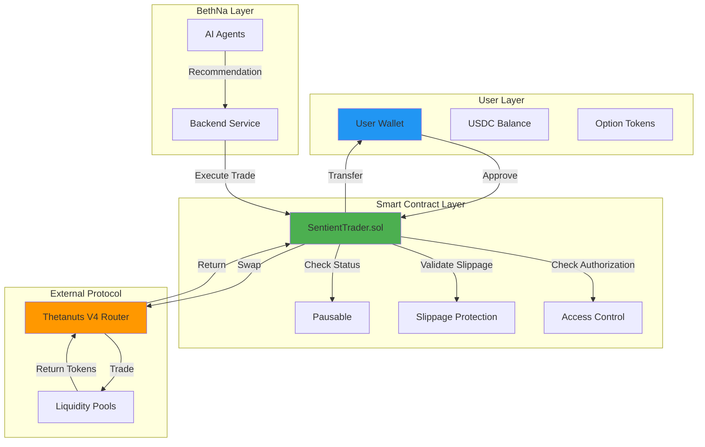

# Architecture Diagram

This diagram shows the complete architecture of the SentientTrader protocol, including user layer, BethNa layer, smart contract layer, and external protocol integration.

## Components Overview

### User Layer
- **User Wallet**: End-user's wallet containing assets
- **USDC Balance**: Stablecoin used for purchasing options
- **Option Tokens**: Received option tokens from trades

### BethNa Layer
- **AI Agents**: Autonomous agents that analyze markets and generate recommendations
- **Backend Service**: Executes trades on behalf of users based on agent recommendations

### Smart Contract Layer
- **SentientTrader.sol**: Main contract that handles all trading operations
- **Access Control**: Whitelist system for authorized traders
- **Slippage Protection**: Ensures trades don't exceed maximum slippage
- **Pausable**: Emergency stop mechanism

### External Protocol
- **Thetanuts V4 Router**: External DeFi protocol for options trading
- **Liquidity Pools**: Where actual option trades are executed
