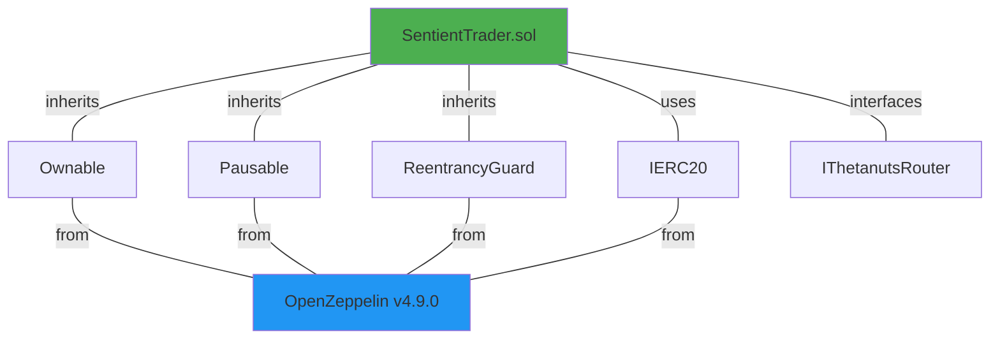

# Contract Dependencies

This diagram shows the dependency structure of the SentientTrader contract and its relationships with OpenZeppelin libraries.

## Dependency Overview

### Core Contract
- **SentientTrader.sol**: Main trading contract that orchestrates all operations

### Inherited Contracts (OpenZeppelin)

#### 1. Ownable
- **Purpose**: Access control for administrative functions
- **Functions Enabled**:
  - `onlyOwner` modifier
  - `transferOwnership()`
  - `renounceOwnership()`
- **Use Case**: Managing authorized traders, updating router, pause controls

#### 2. Pausable
- **Purpose**: Emergency stop mechanism
- **Functions Enabled**:
  - `whenNotPaused` modifier
  - `pause()`
  - `unpause()`
- **Use Case**: Halting all trading during emergencies or upgrades

#### 3. ReentrancyGuard
- **Purpose**: Protection against reentrancy attacks
- **Functions Enabled**:
  - `nonReentrant` modifier
- **Use Case**: Securing trading functions from recursive calls

### Interfaces Used

#### IERC20
- **Purpose**: Standard interface for ERC-20 token interactions
- **Functions Used**:
  - `transferFrom()`: Pull tokens from users
  - `transfer()`: Send tokens to users
  - `approve()`: Approve router to spend tokens
  - `balanceOf()`: Check token balances

#### IThetanutsRouter
- **Purpose**: Interface to Thetanuts V4 protocol
- **Functions Used**:
  - `swapExactTokensForTokens()`: Execute option trades
  - `getAmountsOut()`: Get price quotes

## Library Version

All OpenZeppelin contracts are imported from version **4.9.0**, which provides:
- Battle-tested security
- Gas-optimized implementations
- Comprehensive test coverage
- Industry-standard patterns

## Security Considerations

Using OpenZeppelin libraries provides:
- Audited and vetted code
- Community-reviewed implementations
- Regular security updates
- Best practice patterns
