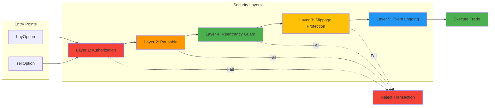

# Security Architecture

This diagram shows the multi-layered security approach implemented in the SentientTrader contract.

## Security Layer Details

### Layer 1: Authorization
- **Purpose**: Whitelist-based access control
- **Implementation**: `onlyAuthorized` modifier
- **Protection**: Prevents unauthorized addresses from executing trades
- **Failure Action**: Transaction reverts with "Not authorized" error

### Layer 2: Pausable
- **Purpose**: Emergency circuit breaker
- **Implementation**: `whenNotPaused` modifier
- **Protection**: Allows admin to halt all trading instantly
- **Failure Action**: Transaction reverts with "Paused" error

### Layer 3: Slippage Protection
- **Purpose**: Prevent unfavorable trades
- **Implementation**: Hard-coded 10% maximum slippage
- **Protection**: Ensures users don't receive less than expected
- **Failure Action**: Transaction reverts with "Slippage exceeded" error

### Layer 4: Reentrancy Guard
- **Purpose**: Prevent reentrancy attacks
- **Implementation**: OpenZeppelin's `ReentrancyGuard`
- **Protection**: Blocks recursive calls to vulnerable functions
- **Failure Action**: Transaction reverts with "ReentrancyGuard" error

### Layer 5: Event Logging
- **Purpose**: Complete audit trail
- **Implementation**: `OptionPurchased` and `OptionSold` events
- **Protection**: Enables transaction monitoring and forensics
- **Action**: All successful trades are logged on-chain

## Defense in Depth

The multi-layer approach ensures that:
- Multiple checks must pass before trade execution
- Single point failures don't compromise the system
- All actions are auditable through event logs
- Emergency mechanisms can halt operations if needed
