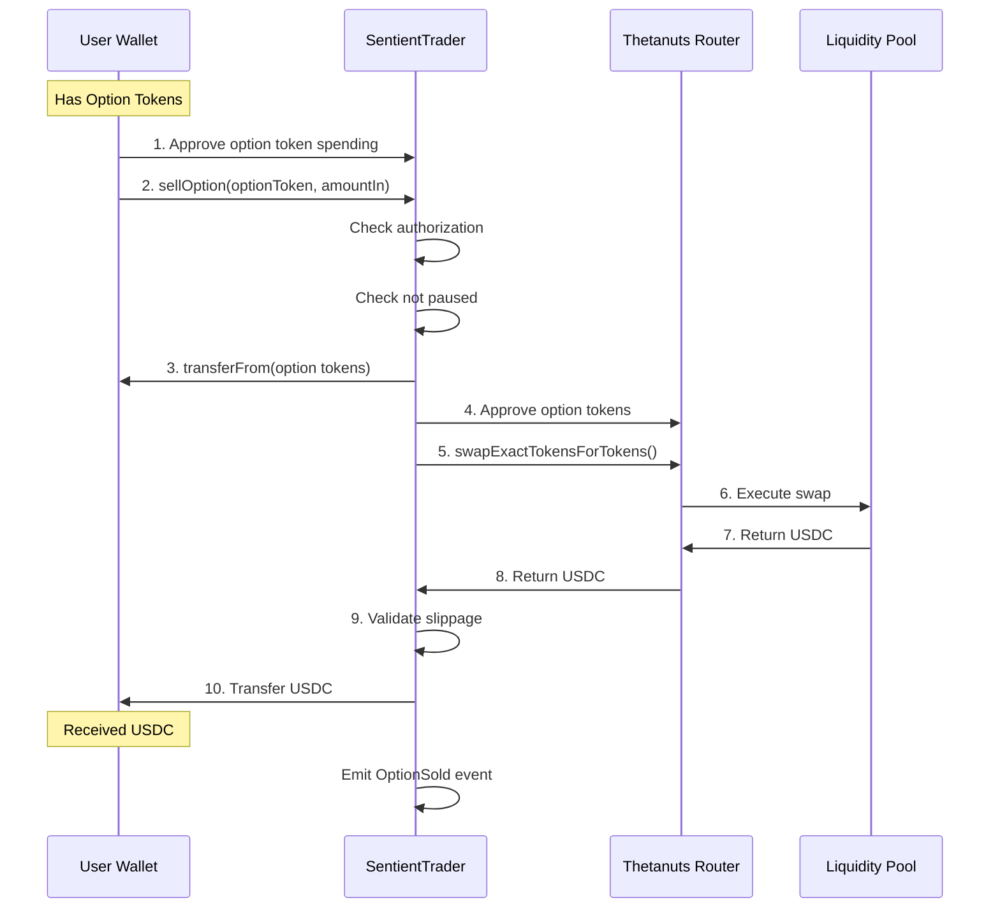

# Sell Option Flow

This sequence diagram illustrates the complete flow when a user sells options through the SentientTrader contract.

## Step-by-Step Breakdown

1. **Approve Option Tokens**: User grants SentientTrader permission to spend option tokens
2. **Call sellOption()**: User initiates the option sale
3. **Authorization Check**: Contract verifies caller is authorized
4. **Pause Check**: Contract ensures trading is not paused
5. **Transfer Tokens**: Contract pulls option tokens from user wallet
6. **Approve to Router**: Contract approves Thetanuts router to spend option tokens
7. **Execute Swap**: Contract calls router to swap option tokens for USDC
8. **Router Execution**: Router executes the swap with liquidity pools
9. **Receive USDC**: USDC is returned to contract
10. **Slippage Validation**: Contract verifies slippage is within acceptable limits
11. **Transfer to User**: USDC is sent to user wallet
12. **Event Emission**: Transaction details are logged on-chain

## Security Checks

- Authorization validation before execution
- Pause mechanism to halt trading if needed
- Slippage protection to prevent unfavorable trades
- Complete event logging for transparency
