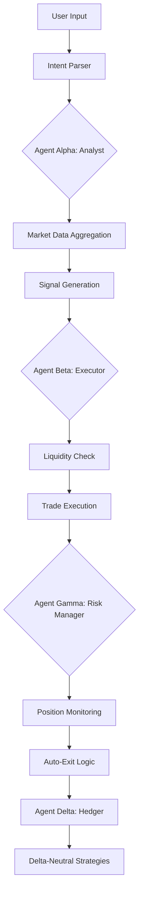

# Intelligence Layer

## The BethNa AI Architecture

BethNa's intelligence layer is a **multi-agent system** where specialized AI entities collaborate to execute complex trading workflows.

## Agent Coordination Flow



## How Agents Communicate

### Inter-Agent Messaging Protocol

Agents exchange **semantic messages** rather than raw data:

#### Example: Bullish Signal Flow

**1. Agent Alpha → Agent Beta**
```json
{
  "signal_type": "LONG_CALL",
  "asset": "ETH",
  "confidence": 0.85,
  "reasoning": "Bullish divergence detected on 4H timeframe. Funding rates negative (long squeeze potential). IV percentile: 35th (underpriced volatility).",
  "recommended_strike": 3200,
  "expiry": "7_DAYS",
  "max_slippage": "5%"
}
```

**2. Agent Beta → Agent Gamma**
```json
{
  "execution_status": "SUCCESS",
  "position_id": "0x742d35Cc...",
  "entry_price": "0.048 ETH",
  "option_type": "CALL",
  "strike": 3200,
  "expiry": "2026-01-17T16:00:00Z",
  "greeks": {
    "delta": 0.32,
    "theta": -0.02,
    "vega": 0.15
  }
}
```

**3. Agent Gamma → User**
```json
{
  "alert_type": "PROFIT_TARGET",
  "message": "Your ETH $3200 Call is up 180%. Consider taking profits.",
  "action": "CLOSE_POSITION",
  "requires_approval": true
}
```

## Intelligence Sources

### 1. On-Chain Data
- **Pyth Network**: Sub-second price feeds
- **Thetanuts V4**: Open interest, volume, liquidity depth
- **Base Network**: Gas prices, block times

### 2. Off-Chain Data
- **Sentiment Analysis**: Twitter, Discord, Reddit (crypto communities)
- **News Aggregation**: CoinDesk, The Block, DeFi Llama
- **Macro Indicators**: BTC dominance, stablecoin supply, ETH gas trends

### 3. Historical Data
- **Backtesting Database**: 3+ years of DeFi options data
- **Pattern Recognition**: Seasonal trends, volatility cycles
- **Performance Metrics**: Strategy win rates, average returns

## Decision-Making Framework

### Agent Alpha's Analysis Process

**Step 1: Data Ingestion**
- Pull latest price data (Pyth)
- Check funding rates (perp markets)
- Analyze social sentiment (NLP)
- Review historical volatility

**Step 2: Pattern Recognition**
- Identify chart patterns (e.g., ascending triangle)
- Detect divergences (price vs. momentum)
- Calculate volatility compression
- Assess trend strength

**Step 3: Signal Generation**
```python
if bullish_divergence and vol_compression and funding_negative:
    signal = "STRONG_BULLISH"
    confidence = 0.85
    recommended_strategy = "LONG_CALL"
```

**Step 4: Risk Assessment**
- Calculate optimal position size
- Set stop-loss thresholds
- Define take-profit targets
- Estimate max drawdown

**Step 5: User Communication**
- Translate technical signals into plain English
- Provide educational context
- Present multiple options with pros/cons

## Reinforcement Learning

BethNa agents **learn from outcomes**:

### Feedback Loop
1. Agent Alpha makes a recommendation
2. Agent Beta executes the trade
3. Agent Gamma tracks the result
4. System records: signal → outcome → P&L
5. Machine learning model adjusts future recommendations

### Example Learning Scenario

**Initial State**:
- Agent Alpha recommends ETH calls during negative funding
- Win rate: 55%

**After 100 Trades**:
- System learns: Negative funding + low IV → 72% win rate
- System learns: Negative funding + high IV → 48% win rate
- **Adaptation**: Only recommend calls when IV is low

## Safety Mechanisms

### 1. Confidence Thresholds
- Agents only execute with >70% confidence
- Low-confidence signals are presented as "educational suggestions"

### 2. Human Override
- Users can always reject agent recommendations
- Manual trading mode available
- "Explain this strategy" feature for transparency

### 3. Position Limits
- Maximum position size: 20% of portfolio
- Maximum open positions: 10 concurrent trades
- Daily loss limit: 5% of portfolio

---


**Next**: See our [Key Differentiators](differentiators.md)

